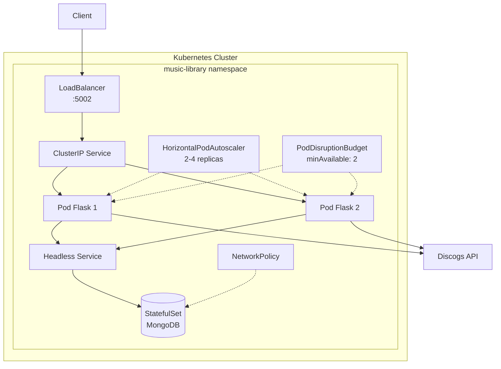

# 🎵 Music Library

[](https://www.python.org/downloads/)
[](LICENSE)
[](docker-compose.yml)
[](https://github.com/0xSirel/Music-Library/actions/workflows/build.yml)

A music library application that allows you to search for albums and artists in a database of vinyl, CD and cassette powered by **Discogs** and save them in your local library.

## ✨ Features

- 🔍 Search albums and artists via Discogs API
- 💾 Save your collection to MongoDB
- 🐳 Docker & Kubernetes ready
- 🧪 Comprehensive test suite

## 🏗️ Architecture



## 📡 API Endpoints

| Method | Endpoint | Description |
|--------|----------|-------------|
| `GET` | `/api/search?name=<album>` | Search albums by name |
| `POST` | `/api/add` | Add album to library |
| `GET` | `/api/get/<id>` | Get album by ID |
| `DELETE` | `/api/remove/<id>` | Remove album by ID |
| `GET` | `/api/print` | Get all albums in library |
| `GET` | `/api/health_check` | Health check endpoint |

## 📋 Requirements

- Python 3.13+
- [uv](https://docs.astral.sh/uv/) (recommended) or pip
- Docker & Docker Compose (for containerized deployment)

## 🚀 Quick Start

### Using Docker (recommended)

1. Copy the environment file and configure it:

```bash
cp .env.example .env
```

2. Edit `.env` with your Discogs token (see [Configuration](#%EF%B8%8F-configuration))

3. Start the application:

```bash
docker compose up -d
```

4. Access the API at `http://localhost:5002`

### Local Development

1. Install dependencies:

```bash
uv sync --dev
```

2. Configure environment variables (see [Configuration](#%EF%B8%8F-configuration))

3. Run the application:

```bash
uv run python src/musiclibrary/main.py
```

## ⚙️ Configuration

Before running the application, set up your environment variables:

1. **Get your Discogs API token:**
   - Go to [Discogs Developer Settings](https://www.discogs.com/settings/developers)
   - Generate a personal access token

2. **Create your `.env` file:**

```bash
cp .env.example .env
```

3. **Configure the variables:**

| Variable | Description | Default |
|----------|-------------|---------|
| `DISCOGS_TOKEN` | Your Discogs API token | *required* |
| `FLASK_ENV` | Flask environment | `development` |
| `MONGO_USER` | MongoDB username | `root` |
| `MONGO_PASS` | MongoDB password | `example` |
| `MONGO_HOST` | MongoDB host | `mongo` |
| `MONGO_PORT` | MongoDB port | `27017` |
| `MONGO_DB` | Database name | `Music-Library` |

## 🛠️ Development

### Available Make Commands

```bash
make help      # Show all available commands
make clean     # Clean build artifacts
make lint      # Run linter (ruff)
make typecheck # Run type checker (mypy)
make test      # Run tests with coverage
make build     # Build wheel package
make install   # Build and install package
make all       # Run full CI pipeline (lint, typecheck, test, build)
```

## 📦 Building

Build the wheel distribution:

```bash
make build
```

Install the built package:

```bash
make install
```

## ☸️ Kubernetes Deployment

Kubernetes manifests are available in the `Kubernetes/` directory. Run [Kubernetes/kube-start.sh](Kubernetes/kube-start.sh) for a quick start.

## 📄 License

This project is licensed under the MIT License - see the [LICENSE](LICENSE) file for details.

## 🙏 Credits

- [Discogs API](https://www.discogs.com/developers/) for album and artist data
- Data provided by Discogs under [CC0 1.0 Universal](https://creativecommons.org/public-domain/cc0/)
