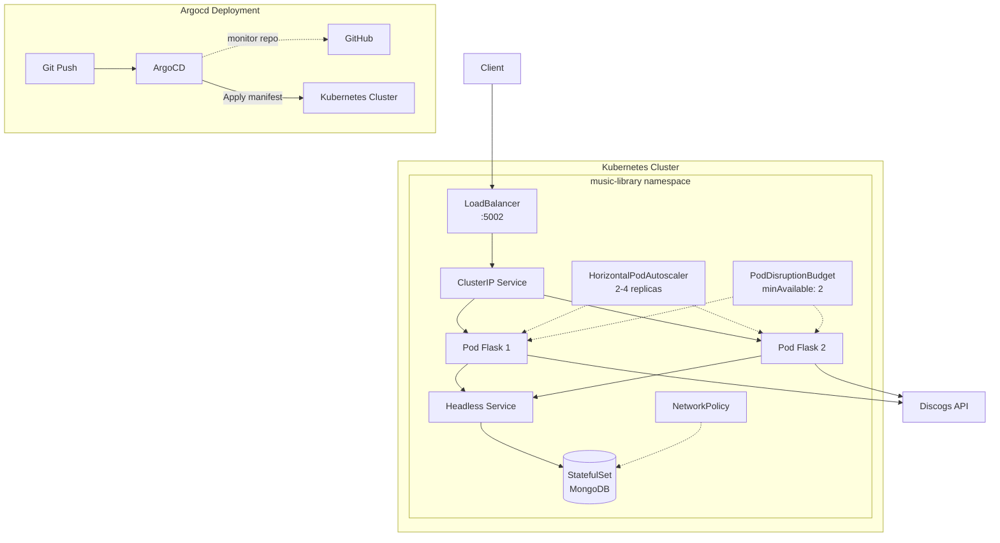

# 🎵 Music Library

[](https://www.python.org/downloads/)
[](#)
[](#)
[](#)
[](https://github.com/0xSirel/Music-Library/actions/workflows/build.yml)

A music library application that allows you to search for albums and artists in a database of vinyl, CD and cassette powered by Discogs and save them in your local library.

## ✨ Features

- 🔍 Search albums and artists via Discogs API
- 💾 Save your collection to MongoDB
- 🐳 Docker images & Kubernetes manifest
- 🚀 Deploy with ArgoCD

## 🏗️ Architecture


```mermaid
graph TB
    subgraph Argocd Deployment
        Dev[Git Push] --> ArgoCD[ArgoCD]
        ArgoCD -. monitor repo .-> Git[GitHub]
        ArgoCD -- Apply manifest --> K8s[Kubernetes Cluster]
    end
    subgraph Kubernetes Cluster
        subgraph music-library namespace
            LB[LoadBalancer\n:5002] --> SVC[ClusterIP Service]
            SVC --> POD1[Pod Flask 1]
            SVC --> POD2[Pod Flask 2]
            POD1 --> HS[Headless Service]
            POD2 --> HS
            HS --> MONGO[(StatefulSet\nMongoDB)]
            HPA[HorizontalPodAutoscaler\n2-4 replicas] -.-> POD1
            HPA -.-> POD2
            PDB[PodDisruptionBudget\nminAvailable: 2] -.-> POD1
            PDB -.-> POD2
            NP[NetworkPolicy] -.-> MONGO
        end
    end
    Client[Client] --> LB
    POD1 --> Discogs[Discogs API]
    POD2 --> Discogs
```

## 📡 API Endpoints

| Method | Endpoint | Description |
|--------|----------|-------------|
| `GET` | `/api/search?name=<album>` | Search albums by name |
| `POST` | `/api/add` | Add album to library |
| `GET` | `/api/get/<id>` | Get album by ID |
| `DELETE` | `/api/remove/<id>` | Remove album by ID |
| `GET` | `/api/print` | Get all albums in library |
| `GET` | `/api/health_check` | Health check endpoint |

## ☸️ Kubernetes Deployment

### Prerequisites
- Kubernetes cluster (minikube, EKS, GKE, etc.)
- Helm 3+
- ArgoCD CLI (optional)

### Quick Start with ArgoCD

1. **Install ArgoCD** using Helm:
```bash
helm repo add argo https://argoproj.github.io/argo-helm
helm repo update
helm install argocd argo/argo-cd -n argocd --create-namespace
```

2. **Configure ArgoCD to deploy Music Library:**
```bash
kubectl apply -f Kubernetes/ArgoCD/argocd-deploy-project.yaml
kubectl apply -f Kubernetes/ArgoCD/argocd-deploy.yaml
```

### Manual Deployment with Helm

Deploy directly without ArgoCD:
```bash
helm install music-library ./Kubernetes/music-library-chart \
  -n music-library \
  --create-namespace
```

### Access the Application

```bash
# Get the LoadBalancer IP
kubectl get svc -n music-library music-library-lb

# Or port-forward to localhost
kubectl port-forward -n music-library svc/music-library 5002:5002
```

Access at `http://localhost:5002` or the LoadBalancer IP.

### Chart Configuration

- **Helm Chart:** `Kubernetes/music-library-chart/`
- **Values:** `Kubernetes/music-library-chart/values.yaml`
- **ArgoCD Configuration:** `Kubernetes/ArgoCD/`

## 📋 Requirements

- Python 3.13+
- [uv](https://docs.astral.sh/uv/) (recommended) or pip
- Docker & Docker Compose (for containerized deployment)

## 🐳 Docker Deployment
### Pull the Docker Image

```bash
docker pull ghcr.io/0xSirel/Music-Library:vX.Y.Z
```
### Run the Docker Container

```bash
docker run -p 5002:5002 \
  -e MONGO_URI=mongodb://mongodb:27017 \
  -e DISCOGS_TOKEN=your_token_here \
  ghcr.io/0xSirel/Music-Library:vX.Y.Z
```
Replace vX.Y.Z with the latest release version.
### Using Docker Compose

1. Copy the environment file:

```bash
cp .env.example .env
```

2. Edit `.env` with your Discogs token

3. Start the application:

```bash
docker compose up -d
```

4. Access at `http://localhost:5002`

## 🚀 Local Development

### Prerequisites
- Python 3.13+
- [uv](https://docs.astral.sh/uv/) (recommended)
- MongoDB running locally

### With uv (Recommended)

```bash
# Install dependencies
uv sync --dev

# Configure environment (see Configuration section below)
cp .env.example .env

# Run the application
uv run python -m musiclibrary.main
```

## ⚙️ Configuration

Before running the application, set up your environment variables:

1. **Get your Discogs API token:**
   - Go to [Discogs Developer Settings](https://www.discogs.com/settings/developers)
   - Generate a personal access token

2. **Create your `.env` file:**

```bash
cp .env.example .env
```

3. **Configure the variables:**

| Variable | Description | Default |
|----------|-------------|---------|
| `DISCOGS_TOKEN` | Your Discogs API token | *required* |
| `FLASK_ENV` | Flask environment | `development` |
| `MONGO_USER` | MongoDB username | `root` |
| `MONGO_PASS` | MongoDB password | `example` |
| `MONGO_HOST` | MongoDB host | `mongo` |
| `MONGO_PORT` | MongoDB port | `27017` |
| `MONGO_DB` | Database name | `Music-Library` |

## 🛠️ Development

### Available Make Commands

```bash
make help      # Show all available commands
make clean     # Clean build artifacts
make lint      # Run linter (ruff)
make typecheck # Run type checker (mypy)
make test      # Run tests with coverage
make build     # Build wheel package
make install   # Build and install package
make all       # Run full CI pipeline (lint, typecheck, test, build)
```

### Building Distribution

```bash
make build
```

Install the built package:

```bash
make install
```

## 🙏 Credits

- [Discogs API](https://www.discogs.com/developers/) for album and artist data
- Data provided by Discogs under [CC0 1.0 Universal](https://creativecommons.org/public-domain/cc0/)
